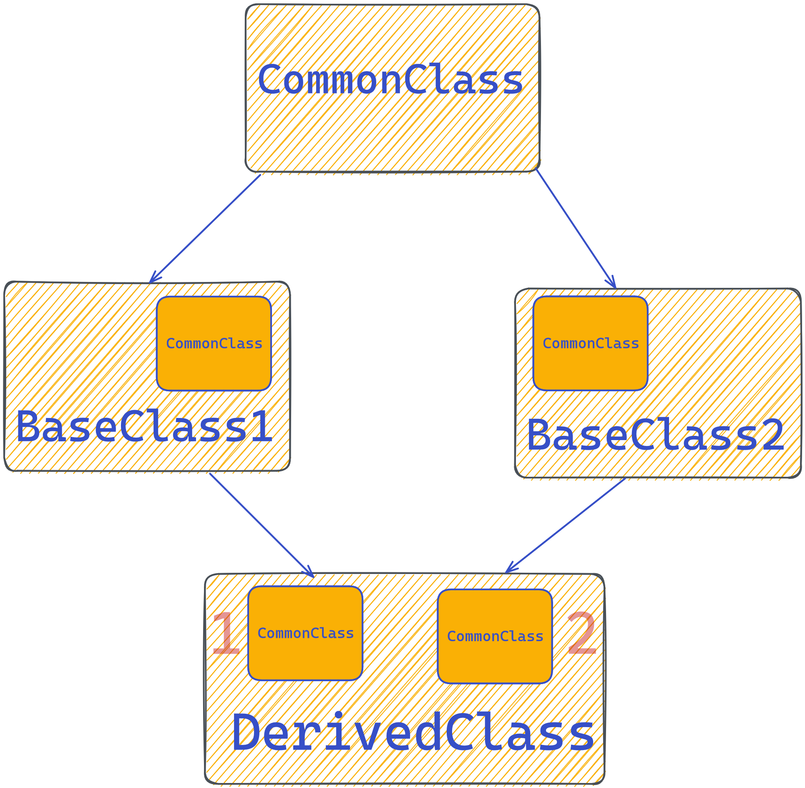

# 
Практикум по "Обектно ориентирано програмиране"

## Множествено наследяване(Diamond problem)

### Какво представлява диамантения проблем?

### Как се решава този проблем?

## Задача 1

Довършете задачата от [**`миналия път`**](https://github.com/PetrovAlex1/ObjectOrientedPrograming-IS-2023/tree/master/week9#%D0%BF%D1%80%D0%B0%D0%BA%D1%82%D0%B8%D0%BA%D1%83%D0%BC-%D0%BF%D0%BE-%D0%BE%D0%B1%D0%B5%D0%BA%D1%82%D0%BD%D0%BE-%D0%BE%D1%80%D0%B8%D0%B5%D0%BD%D1%82%D0%B8%D1%80%D0%B0%D0%BD%D0%BE-%D0%BF%D1%80%D0%BE%D0%B3%D1%80%D0%B0%D0%BC%D0%B8%D1%80%D0%B0%D0%BD%D0%B5) като този път трябва всеки клас да притежава метод `clone`. Нека базовия клас да бъде абстрактен клас.  

## Задача 2 :tumbler_glass:

Да се дефинира клас __`Whiskey`__, който се характеризира с марка и години на отлежаване. Нека класа има метод description(), който печата съобщение по следния шаблон "This is [name] whisky in [age] years.". Нека __`Whiskey`__ е абстрактен клас.

Да се дефинира клас __`Scotch`__, който освен име и години, пази в себе си и тип, т.е. дали е `Single malt`, `Single grain`, `Blended malt` или `Blended grain` и също символен низ от кой регион е. Нека класа разширява метода description() като печата цялата тази информация на стандартния изход.

Да се дефинира също и клас __`Bourbon`__. Нека той също съдържа същите характеристики като `Whiskey` като към него добавим дали е отлежал в една или много бъчви(за допълнителни аромати). Той също разширява метода description(), обаче с едно условие, ако марката е Jim Beam да се изпечата съобщението "At least it's not Savoy!", в противен случай да се изпечата наличната информация.

На последно място да се дефинира класа __`BlendedWhiskey`__, който представлява уиски __`Scotch`__ смесен със __`Bourbon`__. Нека неговия метод description() принтира съобщението "This is blended whiskey" конкатенирано със цялата информацията за уискито.

###### Консумирай с мярка!